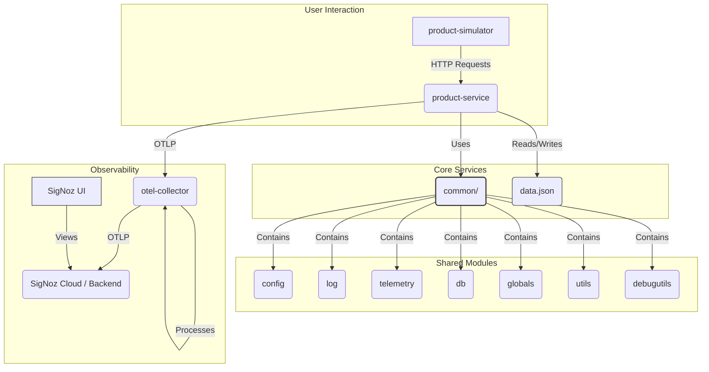

**Purpose:** This page provides a high-level overview of the system architecture, its main components, and how they interact.
**Audience:** Developers, DevOps, Architects, Students
**Prerequisites:** None
**Related Pages:** [[Service Details]], [[Data Model & Persistence]], [[Monitoring Overview]]

---

## 1. System Components

The system currently consists of the following main services orchestrated via `docker-compose.yml`:

1.  **`product-service`:** The main backend service written in Go. It exposes an HTTP API (using the Fiber framework) for managing product data (CRUD operations) stored in a JSON file. It is instrumented with OpenTelemetry.
2.  **`product-simulator`:** A Python script running as a service. It continuously sends HTTP requests to the `product-service` API to simulate user load and generate telemetry data within the `product-service`.
3.  **`otel-collector`:** An instance of the OpenTelemetry Collector (contrib distribution). It receives telemetry data (traces, metrics, logs) via OTLP from the `product-service`, processes it (batching, adding attributes), and exports it to SigNoz Cloud.
4.  **`signoz` components:** (Implicitly included via `docker-compose.yml`) The SigNoz backend services (query-service, otel-collector, frontend) necessary for storing and visualizing the telemetry data.

**Interaction:** The `product-simulator` makes HTTP requests to `product-service`. The `product-service` reads/writes `data.json` and sends telemetry (traces, metrics, logs) via OTLP to the `otel-collector`. The `otel-collector` forwards this data to the SigNoz backend.

---

## 2. Shared Code (`common/` module)

Core infrastructure code shared across Go services (currently just `product-service`) is located in the `common/` Go module. This includes packages for:

*   **Configuration (`common/config`):** Manages loading configuration settings. See [[Configuration Management]].
*   **Logging (`common/log`):** Provides structured logging using `slog`, integrated with OTel. See [[Logging Details]].
*   **Database (`common/db`):** Provides access to the file-based JSON data store (`FileDatabase`). See [[Data Model & Persistence]].
*   **Telemetry (`common/telemetry`):** Handles OpenTelemetry SDK initialization (traces, metrics, logs, resource) and includes helper functions/constants. See [[Telemetry Setup]].
*   **Utilities (`common/utils`):** Contains general utility functions (e.g., `GetCallerFunctionName`).
*   **Globals (`common/globals`):** Provides centralized initialization (`Init()`) for config, logging, and telemetry, plus global accessors (`Cfg()`, `Logger()`). Uses `sync.Once` for safe initialization. **Note:** The `Init()` function currently hardcodes the environment to "production" for config loading purposes, impacting OTel endpoint selection.
*   **Debug Utils (`common/debugutils`):** Contains utilities for simulating delays (`Simulate` function).

---

## 3. Technology Stack

*   **Backend Language:** Go (`product-service`, `common` module)
*   **Simulator Language:** Python (`product-simulator`)
*   **Web Framework:** Fiber (Go)
*   **Containerization:** Docker, Docker Compose
*   **Observability:** OpenTelemetry (Go SDK, Collector), SigNoz (Backend)
*   **API Style:** RESTful HTTP
*   **Data Storage:** JSON file (`data.json`)

---

## 4. Data Flow

1.  **User Simulation:** `product-simulator` sends HTTP requests (GET, POST, PATCH) to `product-service` endpoints.
2.  **Service Handling:** `product-service` receives requests, processes them through handler/service/repository layers.
3.  **Data Persistence:** `product-service` repository layer reads from and writes to `data.json` (via `common/db`).
4.  **Service Response:** `product-service` sends HTTP responses back to `product-simulator`.
5.  **Telemetry Generation:** `product-service` generates traces, metrics, and logs during request processing using the `common/telemetry` module.
6.  **Telemetry Collection:** `product-service` sends telemetry via OTLP/gRPC to `otel-collector`.
7.  **Telemetry Processing:** `otel-collector` batches data, adds resource attributes.
8.  **Telemetry Export:** `otel-collector` exports processed telemetry via OTLP/gRPC to SigNoz Cloud.
9.  **Visualization:** Users view telemetry data in the SigNoz UI.

---

## 5. Visuals & Diagrams

*Fig 1: High-Level Architecture Diagram.*

---

## 6. Teaching Points & Demo Walkthrough

*   **Key Takeaway:** The system is a microservices-based application (though currently simple with one main service + simulator) using Go, containerized with Docker, and instrumented with OpenTelemetry for observability, sending data via a collector to SigNoz.
*   **Demo Steps:**
    1.  Show `docker-compose.yml` highlighting the defined services (`product-service`, `product-simulator`, `otel-collector`, SigNoz components).
    2.  Briefly explain the role of each service using the architecture diagram.
    3.  Navigate the `common/` directory, explaining the purpose of key sub-packages (config, log, db, telemetry).
*   **Common Pitfalls / Questions:**
    *   Is this production-ready architecture? (It's a demonstration focused on observability setup. Production would need a proper database, more robust error handling, security, potentially separate simulator deployment, etc.).
    *   Why use a `common` module? (Promotes code reuse, consistency across potential future Go services).
*   **Simplification Analogy:** Think of it like a small restaurant. `product-service` is the kitchen preparing food (API responses). `product-simulator` is a customer placing orders. `otel-collector` is like a manager watching the kitchen and customers, taking notes (telemetry), and sending reports to headquarters (SigNoz backend). The SigNoz UI is the dashboard at headquarters to view these reports. The `common/` module contains standard kitchen tools and procedures used by the kitchen.

---

**Last Updated:** [Current Date]
