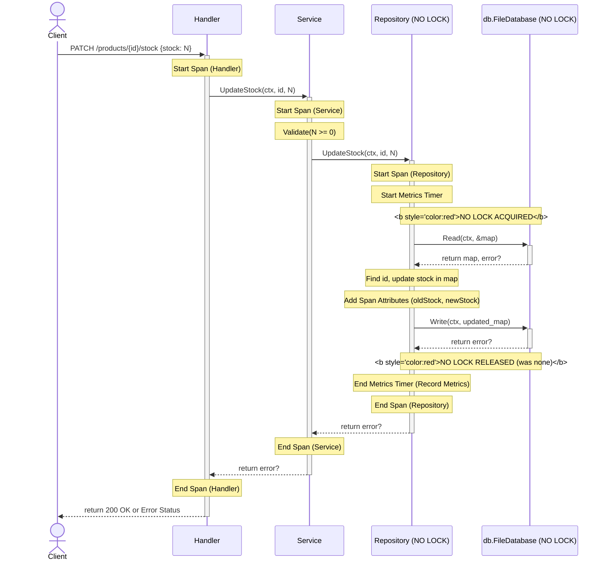

# Feature: Update Product Stock

**Purpose:** Describe the API endpoint and logic for updating the stock quantity of an existing product.
**Prerequisites:** [Product Service API Endpoints](./Product_Service_API_Endpoints.md), [Data Model & Persistence](../../architecture/Data_Model_&_Persistence.md)
**Related Pages:** `product-service/src/handler.go`, `product-service/src/service.go`, `product-service/src/repository.go`

---

## 1. Overview & Key Concepts
This feature provides a mechanism to adjust the inventory count for a product identified by its ID.

*   **Core Responsibility:** Modify the `stock` field of a specific product in the data store.
*   **Why it Matters:** Allows managing product inventory levels based on sales, returns, or manual adjustments. **WARNING:** Current implementation is not safe for concurrent updates.

---

## 2. Configuration & Setup
This feature relies on the standard application configuration for logging and telemetry. No feature-specific configuration is required.

**Relevant Files:**
*   `product-service/src/handler.go`: Contains the `UpdateProductStock` HTTP handler.
*   `product-service/src/service.go`: Contains the `UpdateStock` business logic.
*   `product-service/src/repository.go`: Contains the `UpdateStock` data access logic. **Crucially, it lacks necessary locking.**

---

## 3. Implementation Details & Usage

### Workflow / Logic:
1.  **HTTP Request:** Client sends a `PATCH` request to `/products/{productID}/stock` with JSON body `{"stock": <new_stock_value>}`.
2.  **Handler (`handler.go#UpdateProductStock`):**
    *   Extracts `productID` from the URL path.
    *   Parses the request body.
    *   Starts an OpenTelemetry span.
    *   Calls the `service.UpdateStock` method.
    *   Handles errors returned from the service (e.g., product not found, invalid stock value).
    *   Ends the span, recording errors if any.
    *   Returns HTTP `200 OK` on success or an appropriate error status.
3.  **Service (`service.go#UpdateStock`):**
    *   Starts an OpenTelemetry span, adding `product.id` and `product.new_stock` attributes.
    *   Performs validation (check if `newStock` is non-negative).
    *   Calls the `repository.UpdateStock` method.
    *   Ends the span, recording errors if any.
    *   Returns the result/error from the repository.
4.  **Repository (`repository.go#UpdateStock`):**
    *   Starts an OpenTelemetry span, adding attributes like `db.file.path` and `product.id`.
    *   Starts a metrics timer using `commonmetric.StartMetricsTimer("repository", "UpdateStock")`.
    *   **!!! CRITICAL FLAW !!! Does NOT acquire any lock** (`sync.Mutex`) for the read-modify-write sequence.
    *   **Reads** the current product data map (`repo.products`) via `fileDB.Read()` (which also lacks locking).
    *   Finds the product by `productID`. Returns `ErrProductNotFound` if missing.
    *   Adds attribute `product.old_stock` (value before update) to the span.
    *   **Modifies** the `stock` field for the found product in the map.
    *   Adds attribute `product.new_stock` to the span.
    *   Calls `fileDB.Write()` (which also lacks locking) to **write** the *entire modified map* back to `data.json`.
    *   **!!! RACE CONDITION WINDOW !!!** Another request could have read the same data and written its own update between this request's Read and Write, causing data loss.
    *   Ends the metrics timer (`defer mc.End(...)`), recording duration, count, and error status for `app.operations.*` metrics with `app.layer=repository` and `app.operation=UpdateStock` attributes.
    *   Ends the span, recording errors if any.
    *   Returns success or error.

### Request/Response:
*   **Request:** `PATCH /products/{productID}/stock`
    *   Headers: `Content-Type: application/json`
    *   Body:
        ```json
        {
          "stock": 150
        }
        ```
*   **Success Response (200 OK):**
    ```json
    {
      "status": "ok"
    }
    ```
*   **Error Responses:** `400 Bad Request`, `404 Not Found`, `500 Internal Server Error` (with details depending on the error).

### Code Examples:
*   **Handler Logic (`product-service/src/handler.go`):** (Simplified)
    ```go
    // ... (Handler code as before) ...
    ```
*   **Service Logic (`product-service/src/service.go`):** (Simplified)
    ```go
    // ... (Service code as before) ...
    ```
*   **Repository Logic (`product-service/src/repository.go`):** (Simplified - Highlighting lack of lock)
    ```go
    func (r *productRepository) UpdateStock(ctx context.Context, productID string, newStock int) (opErr error) {
        mc := commonmetric.StartMetricsTimer("repository", "UpdateStock")
        ctx, span := commontrace.StartSpan(ctx, attribute.String(attributes.AppProductID, productID))
        defer func() {
            mc.End(ctx, &opErr, attribute.String(attributes.AppProductID, productID))
            commontrace.EndSpan(span, &opErr, nil)
        }()

        // r.mu.Lock() // <<< !!! THIS IS MISSING !!! >>>
        // defer r.mu.Unlock()

        // Read (No Lock)
        var productsMap map[string]Product
        err := r.database.Read(ctx, &productsMap)
        if err != nil { /* handle error */ }
        // << RACE CONDITION WINDOW STARTS >>

        product, exists := productsMap[productID]
        if !exists { /* handle error */ }
        
        span.SetAttributes(attribute.Int(attributes.ProductOldStock, product.Stock))

        // Modify in-memory map (No Lock)
        product.Stock = newStock
        r.products[productID] = product 
        span.SetAttributes(attribute.Int(attributes.ProductNewStock, newStock))

        // << ANOTHER REQUEST CAN WRITE HERE >>

        // Write (No Lock)
        opErr = r.database.Write(ctx, productsMap)
        // << RACE CONDITION WINDOW ENDS >>

        return opErr
    }
    ```

---

## 4. Monitoring & Observability Integration
*   **Logs:** Informational logs are emitted at Handler and Service layers detailing the request progress. Errors are logged with context. Repository layer logs file operations. Key attributes: `productID`, `newStock`.
*   **Traces:** Spans are created at the Handler, Service, and Repository layers.
    *   Context propagation links these spans together.
    *   Key attributes added: `product.id`, `product.new_stock`, `product.old_stock`, `db.file.path`, `code.function`, `code.namespace`.
    *   Errors are recorded on spans with messages and types.
*   **Metrics:** The `MetricsController` used in the repository records:
    *   `app.operations.total` (Counter): Incremented for each call, with attributes `app.layer=repository`, `app.operation=UpdateStock`, `app.error=(true|false)`, `product.id`.
    *   `app.operations.duration_milliseconds` (Histogram): Records duration, with the same attributes.
    *   `app.operations.errors.total` (Counter): Incremented on error, with the same attributes (`app.error=true`).
    *   These metrics allow tracking the frequency, latency, and error rate specifically for the stock update operation at the repository level.

---

## 5. Visuals & Diagrams


*Fig 1: Sequence Diagram for Update Stock Feature (**Warning:** Highlighting lack of locking and race condition).*

---

## 6. Teaching Points & Demo Walkthrough
*   **Key Takeaway:** This feature demonstrates a typical API workflow BUT **critically fails** to implement necessary concurrency control (`sync.Mutex`) for its read-modify-write persistence logic, making it **unsafe for concurrent use**.
*   **Demo Steps:**
    1.  Show the handler, service, and repository code for `UpdateStock`, **explicitly pointing out the MISSING mutex lock/unlock** calls around the read/modify/write section in the repository.
    2.  Explain the race condition as described in [Data Model & Persistence](../../architecture/Data_Model_&_Persistence.md).
    3.  Use `curl` or a similar tool to send **multiple concurrent** `PATCH` requests to update the *same* product's stock quickly.
        ```bash
        # Example (run several times quickly)
        curl -X PATCH -H "Content-Type: application/json" -d '{"stock": 10}' http://localhost:8082/products/PRODUCT_ID_HERE/stock &
        curl -X PATCH -H "Content-Type: application/json" -d '{"stock": 20}' http://localhost:8082/products/PRODUCT_ID_HERE/stock &
        wait 
        ```
    4.  Query the product (`GET /products/PRODUCT_ID_HERE`) and show that the final stock value is likely incorrect (e.g., 10 or 20, not the result of sequential updates) due to lost updates.
    5.  Go to SigNoz:
        *   Find the traces for the concurrent requests. Show that both might appear successful individually, but the final state is wrong.
        *   Check logs/metrics - they won't necessarily indicate the data corruption.
*   **Common Pitfalls / Questions:**
    *   What happens if two requests try to update the stock at the same time? (**Race condition!** One update will overwrite the other, leading to data loss. The final state is unpredictable).
    *   How should this be fixed? (Add a `sync.Mutex` to the `productRepository` and lock/unlock it around the entire read-modify-write block in `UpdateStock` and `Create`).

---

**Last Updated:** 2024-07-30
