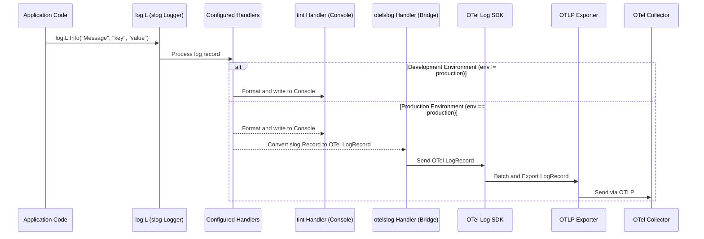

# Logging Details

**Purpose:** This page explains how application logging is implemented using the `common/log` package, how it's configured, and how it integrates with OpenTelemetry for export.
**Audience:** Developers, DevOps, Students
**Prerequisites:** Understanding of Go `slog`, basic OpenTelemetry concepts. See [Glossary](../Glossary.md).
**Related Pages:** [Telemetry Setup](./Telemetry_Setup.md), [`common/log/log.go`](../../common/log/log.go), [Configuration Management](../development/Configuration_Management.md)

---

## 1. Overview & Key Concepts

Application logging is handled by a shared package `common/log`, built upon Go's standard structured logging library, `log/slog`.

*   **Key Concept: Structured Logging:** Logs are emitted as key-value pairs, making them easily machine-parseable and queryable in observability backends.
*   **Key Concept: `slog` Handlers:** `slog` uses handlers to determine *where* log records are written (e.g., console, file, network endpoint). This setup uses multiple handlers depending on the environment.
*   **Core Responsibility:** Provide a consistent way for application code to emit logs, control log verbosity (level), and direct log output to appropriate destinations (console for development, console + OTLP for production).
*   **Why it Matters:** Effective logging is crucial for debugging issues, understanding application flow, and providing context alongside traces and metrics in observability platforms.

---

## 2. Configuration & Setup

Logging is initialized via the `log.Init(logLevelStr, environment string)` function, typically called once during application startup.

**Relevant Files:**
*   `common/log/log.go`
*   `common/config/config.go` (provides `logLevelStr`, `environment`)

**Environment Variables (read via `common/config`):**
*   `LOG_LEVEL`: Controls the minimum severity level of logs to be processed (e.g., `debug`, `info`, `warn`, `error`). Defaults to `info` if invalid.
*   `ENVIRONMENT`: Determines the logging handlers. Set to `production` to enable OTLP export.

**Code Initialization (`common/log/log.go`):**
```go
// Simplified Initialization Logic
func Init(logLevelStr, environment string) error {
    // ... determine slog.Level from logLevelStr (default: INFO)
    handlerOpts := &slog.HandlerOptions{ AddSource: true, Level: level }
    isProduction := strings.ToLower(environment) == "production"
    var handler slog.Handler

    if isProduction {
        // OTLP Handler via otelslog bridge
        // Note: "otlp_logger_placeholder" likely needs to match the
        // Instrumentation Scope name used when setting up the OTel LoggerProvider.
        otlpHandler := otelslog.NewHandler("otlp_logger_placeholder")
        // Console Handler (pretty-printed, RFC3339 time)
        consoleHandler := tint.NewHandler(os.Stdout, &tint.Options{
            Level:      level,
            TimeFormat: time.RFC3339,
            AddSource:  true,
        })
        // Fanout: Send logs to BOTH OTLP and Console
        handler = slogmulti.Fanout(otlpHandler, consoleHandler)
    } else {
        // Console Handler only (pretty-printed, Kitchen time)
        handler = tint.NewHandler(os.Stdout, &tint.Options{
            Level:      level,
            TimeFormat: time.Kitchen,
            AddSource:  true,
        })
    }

    // Create global logger L and set as slog default
    L = slog.New(handler)
    slog.SetDefault(L)
    return nil
}
```

---

## 3. Implementation Details & Usage

The `log.Init` function creates a global logger variable `log.L`. Application code should use this variable to emit logs.

**Usage Example (`product-service/...`):**
```go
package main

import (
    "github.com/narender/common/globals"
    "github.com/narender/common/log"
    stdlog "log"
    "log/slog"
    // ... other imports
)

func main() {
    // Initialize globals (which includes config and logging)
    globals.Init()

    // Example log statement using the global logger
    log.L.Info("Product service started", slog.String("port", globals.Cfg().PRODUCT_SERVICE_PORT))

    // ... other setup

    // Example log with context values
    userID := "user-123"
    productID := "prod-abc"
    someError := errors.New("database timeout") // Example error
    log.L.Warn("Failed to retrieve product details",
        slog.String("user", userID),
        slog.String("product", productID),
        slog.Any("error", someError), // Use slog.Any for errors
    )
}
```

*   The `log.L` logger provides methods like `Debug`, `Info`, `Warn`, `Error`.
*   Additional context should be provided as key-value pairs (strongly typed using `slog.String`, `slog.Int`, `slog.Any` for errors, etc.).

---

## 4. Monitoring & Observability Integration

*   **Logs Emitted:** Application logs generated via `log.L` methods.
*   **OTel Integration:** When `ENVIRONMENT=production`, the `otelslog.NewHandler` acts as a bridge.
    *   It converts `slog.Record` objects into OTel LogRecord objects.
    *   These OTel LogRecords are then processed by the configured OTel `LoggerProvider` (setup in [Telemetry Setup](./Telemetry_Setup.md) via `common/telemetry/log/exporter.go`).
    *   The OTel SDK then exports these LogRecords via OTLP to the Collector.
*   **Attributes:** Key-value pairs added in the `log.L` calls (e.g., `slog.String("user", userID)`) become OTel LogRecord attributes.
*   **Trace Context:** `otelslog` automatically attempts to correlate logs with active traces, injecting `trace_id` and `span_id` into the LogRecords when available.

---

## 5. Visuals & Diagrams


*Fig 1: Logging Data Flow. In production, logs go to both the console (via `tint`) and the OTel pipeline (via `otelslog`).*

---

## 6. Teaching Points & Demo Walkthrough

*   **Key Takeaway:** Structured logging (`slog`) allows logs to be treated as data. The `otelslog` bridge enables sending these structured logs directly into the OpenTelemetry ecosystem for correlation with traces and metrics, but only when configured (in production).
*   **Demo Steps:**
    1.  Show `common/log/log.go`, explaining the `Init` function and the conditional handlers (`tint`, `otelslog`, `slogmulti`).
    2.  Show example usage of `log.L.Info(...)` in `product-service` code.
    3.  Run `docker-compose up` (uses `ENVIRONMENT=production` by default).
    4.  Trigger an action in the `product-service` that logs messages.
    5.  Show the console output (via `tint` handler) using `docker compose logs product-service`.
    6.  Show the corresponding logs appearing in SigNoz (received via OTLP), highlighting the structured attributes and trace correlation (if available).
    7.  (Optional) Modify `docker-compose.yml` to set `ENVIRONMENT=development` for `product-service`, run `docker compose up --build product-service`, trigger actions, and show logs *only* appearing in the console, not SigNoz.
*   **Common Pitfalls / Questions:**
    *   Why are my logs not structured in the console? (The `tint` handler focuses on human readability; structure is preserved for OTLP export).
    *   Why are my logs not appearing in SigNoz? (Check `ENVIRONMENT` variable (and `globals.Init` override), ensure OTLP handler is active in `log.Init`, check [Telemetry Setup](./Telemetry_Setup.md), check Collector pipeline for logs, check SigNoz ingestion key).
    *   How do I add trace IDs to logs? (`otelslog` handles this automatically if tracing is set up correctly and context is propagated).
*   **Simplification Analogy:** Think of `slog` as writing diary entries with specific fields (time, message, user, product). In development (`tint`), you just print the entry nicely to read yourself. In production (`otelslog` + `tint`), you *also* send a digital copy of that structured entry to a central library (OTel Collector/SigNoz) where it can be searched and linked to other events (traces).

---

**Last Updated:**


**Note on Initialization:** If the application uses `common/globals.Init()` for setup, be aware that this function **hardcodes the environment to "production"** when calling `config.LoadConfig` internally. Consequently, when using `globals.Init()`, the `log.Init` function (which receives this hardcoded "production" environment string) will *always* configure both the OTLP handler (via `otelslog`) and the console handler (`tint`), regardless of any external `ENVIRONMENT` variable set for the container. This ensures telemetry export is always attempted when using the global initializer.
