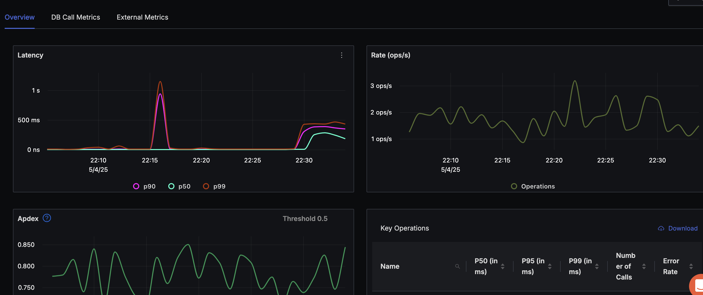
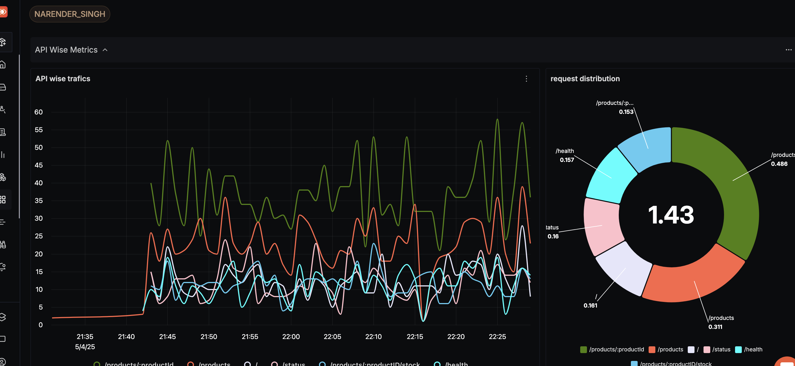
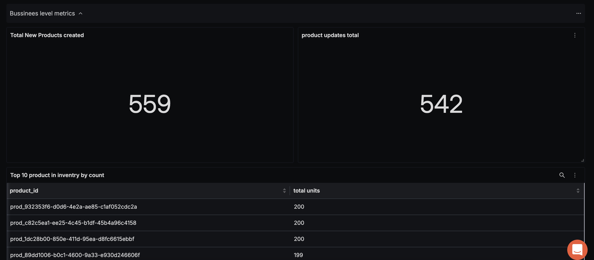
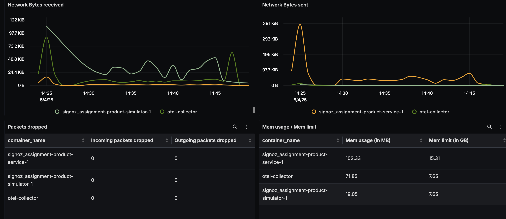
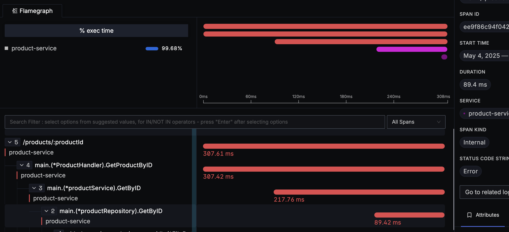

# SigNoz Dashboards

**Purpose:** Provide links to and explanations for relevant dashboards within the SigNoz UI for monitoring the application.
**Prerequisites:** [Running Locally with Docker Compose](../development/Running_Locally_with_Docker_Compose.md), [Monitoring Overview](./README.md), [Key Metrics](./Key_Metrics.md)
**Related Pages:** SigNoz UI ([http://localhost:3301](http://localhost:3301))

---

## 1. Overview

SigNoz allows creating custom dashboards to visualize key metrics and service performance. While default dashboards are available upon installation, creating application-specific dashboards provides the most targeted insights.

This page outlines potential dashboards valuable for this project. You should create these (or similar) dashboards within your SigNoz.

---

# 2. Dashboards

Here are Some dashboards that would be valuable for monitoring this application:
---

### 2.1 Product-Service Overview Dashboard (APM)

**Purpose:** Provide a single-pane snapshot of the health and performance of product-service.

**Key Panels / Metrics:**

- **Latency (P50, P90, P99)** – Track percentile latency trends
- **Request Rate** – Observe operations per second
- **Apdex** – Measure user satisfaction derived from latency
- **Key Operations Table** – View P50/P95/P99 latency, error rate, and call volume per operation
- **Database Call RPS & Avg Duration** – Monitor load and timings for repository operations

**Link:** [Dashboard Link](https://svey-5nsw.in.signoz.cloud/services/product-service?relativeTime=1h)

Screenshot: 

---

### 2.2 Custom Dashboard

**Purpose:** Combine API traffic, error breakdowns, and business KPIs in a single view.

**Key Sections & Panels:**

#### API Wise Metrics
- API‑Wise Traffics (RPS line)
- Request Distribution (donut)

#### Error Details
- Success vs Failure
- Error Codes

#### Business Level Metrics
- Total New Products Created
- Product Updates Total
- Top 10 Products in Inventory

**Link:** [Dashboard Link](https://svey-5nsw.in.signoz.cloud/dashboard/37c0c077-5970-44f4-8e45-132023428435?relativeTime=30m)

**Screenshot:** Screenshot: 
Screenshot: 

---

### 2.3 Container Metrics Dashboard

**Purpose:** Visualize resource consumption and network activity for each container (via the docker_stats receiver).

**Key Panels / Metrics:**
- Container CPU Percent
- Container Memory Percent
- Network Bytes Received / Sent
- Packets Dropped
- Memory Usage vs Limit

**Link:** [Dashboard Link](https://svey-5nsw.in.signoz.cloud/dashboard/72274028-3a1d-4a70-83ae-6097d2457b0d?relativeTime=6h)

**Screenshot:** Screenshot: 

---

### 2.4 Trace Explorer View

**Purpose:** Drill into individual requests to find latency sources and call-stack bottlenecks.

**Key Elements:**
- All Traces List – Timestamp, route, client address, status code
- Flamegraph / Spans – Hierarchical span timings for a single trace

**Link:** [Dashboard Link](https://svey-5nsw.in.signoz.cloud/traces-explorer?compositeQuery=%257B%2522queryType%2522%253A%2522builder%2522%252C%2522builder%2522%253A%257B%2522queryData%2522%253A%255B%257B%2522dataSource%2522%253A%2522traces%2522%252C%2522queryName%2522%253A%2522A%2522%252C%2522aggregateOperator%2522%253A%2522noop%2522%252C%2522aggregateAttribute%2522%253A%257B%2522key%2522%253A%2522%2522%252C%2522dataType%2522%253A%2522%2522%252C%2522type%2522%253A%2522%2522%252C%2522isColumn%2522%253Afalse%252C%2522isJSON%2522%253Afalse%257D%252C%2522timeAggregation%2522%253A%2522rate%2522%252C%2522spaceAggregation%2522%253A%2522sum%2522%252C%2522functions%2522%253A%255B%255D%252C%2522filters%2522%253A%257B%2522op%2522%253A%2522AND%2522%252C%2522items%2522%253A%255B%257B%2522key%2522%253A%257B%2522key%2522%253A%2522service.name%2522%252C%2522dataType%2522%253A%2522string%2522%252C%2522type%2522%253A%2522resource%2522%252C%2522isColumn%2522%253Atrue%252C%2522isJSON%2522%253Afalse%257D%252C%2522value%2522%253A%2522product-service%2522%252C%2522op%2522%253A%2522%253D%2522%257D%252C%257B%2522key%2522%253A%257B%2522key%2522%253A%2522name%2522%252C%2522dataType%2522%253A%2522%2522%252C%2522type%2522%253A%2522%2522%252C%2522isColumn%2522%253Afalse%252C%2522isJSON%2522%253Afalse%257D%252C%2522value%2522%253A%2522%252Fhealth%2522%252C%2522op%2522%253A%2522!%253D%2522%257D%252C%257B%2522key%2522%253A%257B%2522key%2522%253A%2522http.route%2522%252C%2522dataType%2522%253A%2522string%2522%252C%2522type%2522%253A%2522tag%2522%252C%2522isColumn%2522%253Atrue%252C%2522isJSON%2522%253Afalse%257D%252C%2522value%2522%253A%2522%2522%252C%2522op%2522%253A%2522exists%2522%257D%255D%257D%252C%2522expression%2522%253A%2522A%2522%252C%2522disabled%2522%253Afalse%252C%2522stepInterval%2522%253A60%252C%2522having%2522%253A%255B%255D%252C%2522limit%2522%253A0%252C%2522orderBy%2522%253A%255B%257B%2522columnName%2522%253A%2522timestamp%2522%252C%2522order%2522%253A%2522desc%2522%257D%255D%252C%2522groupBy%2522%253A%255B%255D%252C%2522legend%2522%253A%2522%2522%252C%2522reduceTo%2522%253A%2522avg%2522%252C%2522offset%2522%253A0%252C%2522pageSize%2522%253A0%252C%2522ShiftBy%2522%253A0%252C%2522IsAnomaly%2522%253Afalse%252C%2522QueriesUsedInFormula%2522%253Anull%257D%255D%252C%2522queryFormulas%2522%253A%255B%255D%257D%252C%2522promql%2522%253A%255B%257B%2522name%2522%253A%2522A%2522%252C%2522query%2522%253A%2522%2522%252C%2522legend%2522%253A%2522%2522%252C%2522disabled%2522%253Afalse%257D%255D%252C%2522clickhouse_sql%2522%253A%255B%257B%2522name%2522%253A%2522A%2522%252C%2522legend%2522%253A%2522%2522%252C%2522disabled%2522%253Afalse%252C%2522query%2522%253A%2522%2522%257D%255D%252C%2522id%2522%253A%252275c4854a-1a99-4f04-a6cb-053037581c2f%2522%257D&panelTypes=%22list%22&viewName=%22narender_traces%22&viewKey=%220196988e-7656-7841-8b81-efa1e62c141d%22&options=%7B%22selectColumns%22:%5B%7B%22key%22:%22name%22,%22dataType%22:%22string%22,%22type%22:%22tag%22,%22isColumn%22:true,%22isJSON%22:false,%22id%22:%22name--string--tag--true%22,%22isIndexed%22:false%7D,%7B%22key%22:%22client.address%22,%22dataType%22:%22string%22,%22type%22:%22tag%22,%22isColumn%22:false,%22isJSON%22:false,%22id%22:%22client.address--string--tag--false%22%7D,%7B%22key%22:%22http.response.status_code%22,%22dataType%22:%22float64%22,%22type%22:%22tag%22,%22isColumn%22:false,%22isJSON%22:false,%22id%22:%22http.response.status_code--float64--tag--false%22%7D%5D,%22maxLines%22:2,%22format%22:%22raw%22,%22fontSize%22:%22small%22%7D&pagination=%7B%22offset%22:0,%22limit%22:10%7D)

Screenshot: 

---

### 2.5 Logs Explorer View

**Purpose:** Search, filter, and visualize raw logs, then correlate them with traces for context-rich debugging.

**Key Elements:**
- Severity Filter & Frequency Chart – Spot bursts in WARN / ERROR levels
- Facet Filters – Environment, hostname, Kubernetes metadata, etc.
- Views – Toggle between List, Time Series, and Table views

**Link:** [Dashboard Link](https://svey-5nsw.in.signoz.cloud/logs/logs-explorer?compositeQuery=%257B%2522queryType%2522%253A%2522builder%2522%252C%2522builder%2522%253A%257B%2522queryData%2522%253A%255B%257B%2522dataSource%2522%253A%2522logs%2522%252C%2522queryName%2522%253A%2522A%2522%252C%2522aggregateOperator%2522%253A%2522noop%2522%252C%2522aggregateAttribute%2522%253A%257B%2522key%2522%253A%2522%2522%252C%2522dataType%2522%253A%2522%2522%252C%2522type%2522%253A%2522%2522%252C%2522isColumn%2522%253Afalse%252C%2522isJSON%2522%253Afalse%257D%252C%2522timeAggregation%2522%253A%2522rate%2522%252C%2522spaceAggregation%2522%253A%2522sum%2522%252C%2522functions%2522%253A%255B%255D%252C%2522filters%2522%253A%257B%2522op%2522%253A%2522AND%2522%252C%2522items%2522%253A%255B%257B%2522key%2522%253A%257B%2522key%2522%253A%2522service.name%2522%252C%2522dataType%2522%253A%2522string%2522%252C%2522type%2522%253A%2522resource%2522%252C%2522isColumn%2522%253Atrue%252C%2522isJSON%2522%253Afalse%257D%252C%2522value%2522%253A%2522product-service%2522%252C%2522op%2522%253A%2522%253D%2522%257D%255D%257D%252C%2522expression%2522%253A%2522A%2522%252C%2522disabled%2522%253Afalse%252C%2522stepInterval%2522%253A60%252C%2522having%2522%253A%255B%255D%252C%2522limit%2522%253A0%252C%2522orderBy%2522%253A%255B%257B%2522columnName%2522%253A%2522timestamp%2522%252C%2522order%2522%253A%2522desc%2522%257D%255D%252C%2522groupBy%2522%253A%255B%255D%252C%2522legend%2522%253A%2522%2522%252C%2522reduceTo%2522%253A%2522avg%2522%252C%2522offset%2522%253A0%252C%2522pageSize%2522%253A0%252C%2522ShiftBy%2522%253A0%252C%2522IsAnomaly%2522%253Afalse%252C%2522QueriesUsedInFormula%2522%253Anull%257D%255D%252C%2522queryFormulas%2522%253A%255B%255D%257D%252C%2522promql%2522%253A%255B%257B%2522name%2522%253A%2522A%2522%252C%2522query%2522%253A%2522%2522%252C%2522legend%2522%253A%2522%2522%252C%2522disabled%2522%253Afalse%257D%255D%252C%2522clickhouse_sql%2522%253A%255B%257B%2522name%2522%253A%2522A%2522%252C%2522legend%2522%253A%2522%2522%252C%2522disabled%2522%253Afalse%252C%2522query%2522%253A%2522%2522%257D%255D%252C%2522id%2522%253A%25227e826796-9bd4-4bb5-a252-e9a86c285af6%2522%257D&options=%7B%22selectColumns%22%3A%5B%7B%22key%22%3A%22timestamp%22%2C%22dataType%22%3A%22string%22%2C%22type%22%3A%22tag%22%2C%22isColumn%22%3Atrue%2C%22isJSON%22%3Afalse%2C%22id%22%3A%22timestamp--string--tag--true%22%2C%22isIndexed%22%3Afalse%7D%2C%7B%22key%22%3A%22body%22%2C%22dataType%22%3A%22string%22%2C%22type%22%3A%22tag%22%2C%22isColumn%22%3Atrue%2C%22isJSON%22%3Afalse%2C%22id%22%3A%22body--string--tag--true%22%2C%22isIndexed%22%3Afalse%7D%2C%7B%22key%22%3A%22serviceName%22%2C%22dataType%22%3A%22string%22%2C%22type%22%3A%22tag%22%2C%22isColumn%22%3Atrue%2C%22isJSON%22%3Afalse%2C%22id%22%3A%22serviceName--string--tag--true%22%2C%22isIndexed%22%3Afalse%7D%2C%7B%22key%22%3A%22name%22%2C%22dataType%22%3A%22string%22%2C%22type%22%3A%22tag%22%2C%22isColumn%22%3Atrue%2C%22isJSON%22%3Afalse%2C%22id%22%3A%22name--string--tag--true%22%2C%22isIndexed%22%3Afalse%7D%2C%7B%22key%22%3A%22durationNano%22%2C%22dataType%22%3A%22float64%22%2C%22type%22%3A%22tag%22%2C%22isColumn%22%3Atrue%2C%22isJSON%22%3Afalse%2C%22id%22%3A%22durationNano--float64--tag--true%22%2C%22isIndexed%22%3Afalse%7D%2C%7B%22key%22%3A%22httpMethod%22%2C%22dataType%22%3A%22string%22%2C%22type%22%3A%22tag%22%2C%22isColumn%22%3Atrue%2C%22isJSON%22%3Afalse%2C%22id%22%3A%22httpMethod--string--tag--true%22%2C%22isIndexed%22%3Afalse%7D%2C%7B%22key%22%3A%22responseStatusCode%22%2C%22dataType%22%3A%22string%22%2C%22type%22%3A%22tag%22%2C%22isColumn%22%3Atrue%2C%22isJSON%22%3Afalse%2C%22id%22%3A%22responseStatusCode--string--tag--true%22%2C%22isIndexed%22%3Afalse%7D%2C%7B%22key%22%3A%22trace_id%22%2C%22dataType%22%3A%22string%22%2C%22type%22%3A%22tag%22%2C%22isColumn%22%3Afalse%2C%22isJSON%22%3Afalse%2C%22id%22%3A%22trace_id--string--tag--false%22%7D%5D%2C%22maxLines%22%3A2%2C%22format%22%3A%22list%22%2C%22fontSize%22%3A%22small%22%2C%22version%22%3A1%7D&panelTypes=%22list%22&viewName=%22narender_singh%22&viewKey=%220196983d-890c-7e74-9f3b-f26c68719e0c%22&relativeTime=5m)

---

