# 🛒 Go Shop Service

This document provides a plan for a Go service simulating a shop's operations. We'll use a common three-layer architecture (Handler, Service, Repository) and explore functionalities like purchases and receiving stock deliveries. We'll also detail logging and metrics strategies using a shop analogy.

---

### 1. The Shop Analogy: 🏪 Big Bazaar

Imagine our shop is "**Big Bazaar**," a large supermarket. Customers can browse items, check info, and purchase products. The service also handles receiving large, diverse shipments to update inventory.

```mermaid
sequenceDiagram
    autonumber
    participant Cust as Customer
    participant Cash as Front Counter / Cashier (Handler)
    participant Mgr  as Shop Manager (Service)
    participant Clerk as Stock Room Clerk (Repository)

    Cust ->> Cash: "Buy 3 apples" / "List products"
    Cash ->> Mgr: Pass request + Trace ID #123
    Mgr  ->> Clerk: "Check apples stock" + Trace ID #123
    Clerk -->> Mgr: Updates ledger (data.json) – 3<br/>Reports 5 apples left
    Mgr  -->> Cash: Confirms sale (5 left) + Trace ID #123
    Cash -->> Cust: "Sale complete — 5 apples remaining" or product list
```

![[signoz_demo_diagram_1.png]]

- Cashier/Front Counter 🧑‍ cashier: Faces the customer, takes requests, gives results. (*Handler*)
- Shop Manager 🧑‍💼: Knows rules, orchestrates tasks, talks to the stock room. (*Service*)
- Stock Room Clerk 📦: Manages actual items/data, follows service instructions. (*Repository*)

---

